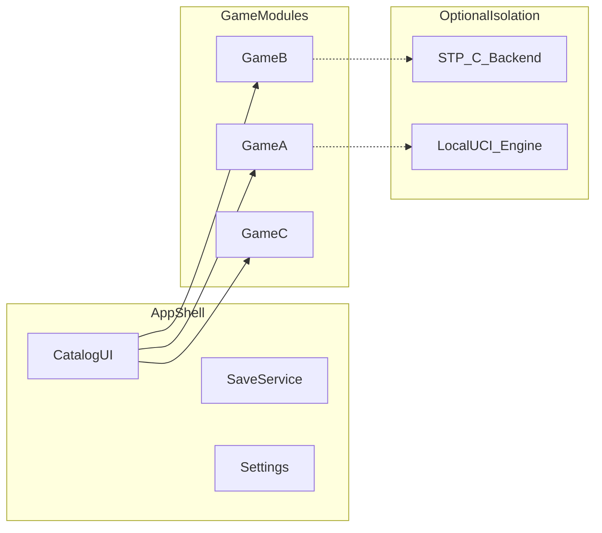

# Engineering plan: PuzzlesAndGames

Companion to [PRD.md](PRD.md). This file is the **technical execution plan** for the repo (not Cursor-internal metadata).

---

## Stack (locked)

| Layer | Choice |
|-------|--------|
| Languages | **C** and/or **C++17** (or C++20) |
| Rationale | Large reusable C puzzle ecosystem; aligns with [Simon Tatham puzzles](https://www.chiark.greenend.org.uk/~sgtatham/puzzles/) upstream (C); avoid heavy runtimes (**no Godot, Flutter, or Electron** for this repo; **Rust not** the primary app language for v1). |
| Build | **CMake** or **Meson**; static link where practical. |
| Graphics | One primary: **SDL2** (zlib) or **Raylib** (zlib), or **GLFW** + minimal 2D (more DIY). |
| Shell UI (optional) | **Dear ImGui** (MIT) on top of SDL2/OpenGL/Vulkan if menus should ship quickly. |
| Fonts | Bundle **Inter** or **Source Sans 3** (OFL) + license text. |

### Open technical forks

- Pick **SDL2 vs Raylib** for v1 (SDL2 is the usual long-term portable default; Raylib is fast to first playable).
- **All-C** vs **C++ shell + C cores** for cleaner RAII in the launcher only.

---

## Architecture



### Module contract (conceptual)

Each game module should expose a small API, for example:

- Identity: stable `game_id`.
- Lifecycle: `init`, `shutdown`, `new_game(config)`, `restart`.
- Loop: `apply_input(event)`, `tick(dt)`, `render(renderer)`.
- State: `serialize`, `deserialize` (for saves and bug reports).
- Help: local rules text or path to bundled doc.

---

## Third-party and reuse

### Simon Tatham Portable Puzzle Collection

- **License**: MIT (confirm in upstream `LICENCE` when vendoring).
- **Source**: `git clone https://git.tartarus.org/simon/puzzles.git`
- **Preferred integration**: implement a **native frontend** against the existing **porting layer** (SDL2/Raylib drawing and input), not a WebView-first path.
- **Scope**: start with a **subset** of puzzles; expand as maintenance allows.

### Chess and similar

- **Stockfish**: GPL-3.0; typical pattern is a **separate local binary** (UCI) to keep the shell license clean, or accept GPL for a combined build.
- **Checkers**: prefer maintained MIT (or compatible) code with tests.

### Other puzzles

- **2048**, **Sudoku generators**: use repos with explicit SPDX licenses; property-test generators (unique solution, etc.).

---

## Trust and CI guardrails

- **No network**: release CMake preset defines that disable optional networking in deps; CI grep/allowlist for `socket`, `connect`, `WSAStartup`, `WinInet`, `WinHTTP`, `curl` (justify exceptions in review).
- **Quality**: ASan/UBSan builds in CI where runners support it; cppcheck or equivalent; fuzz parsers for saves and seeds.
- **Legal**: `third_party/<name>/` with pristine `LICENSE` / `COPYING` files.

---

## Delivery checklist (engineering)

- [ ] Lock toolchain: C standard, C++ standard if used, compiler baseline per OS.
- [ ] Choose SDL2 vs Raylib; add vendored or submodule policy.
- [ ] SPDX license matrix: shell + each game + engines (GPL boundary for chess).
- [ ] Time-box STP spike: one puzzle end-to-end on chosen graphics layer.
- [ ] Catalog shell MVP: one non-STP game complete (save, rules, keyboard).
- [ ] Release engineering: Windows/Linux/macOS artifacts; macOS signing/notarization plan; reproducible build notes.

---

## Repository layout (target, incremental)

Suggested as code lands:

```
PuzzlesAndGames/
  PRD.md
  PLAN.md
  README.md
  LICENSE
  CMakeLists.txt          # or meson.build
  src/                    # shell + shared
  games/                  # one directory per game module
  third_party/            # vendored upstreams + licenses
  .cursor/rules/         # Cursor project rules
```

---

## References

- [PRD.md](PRD.md)
- [Simon Tatham's Portable Puzzle Collection](https://www.chiark.greenend.org.uk/~sgtatham/puzzles/)
