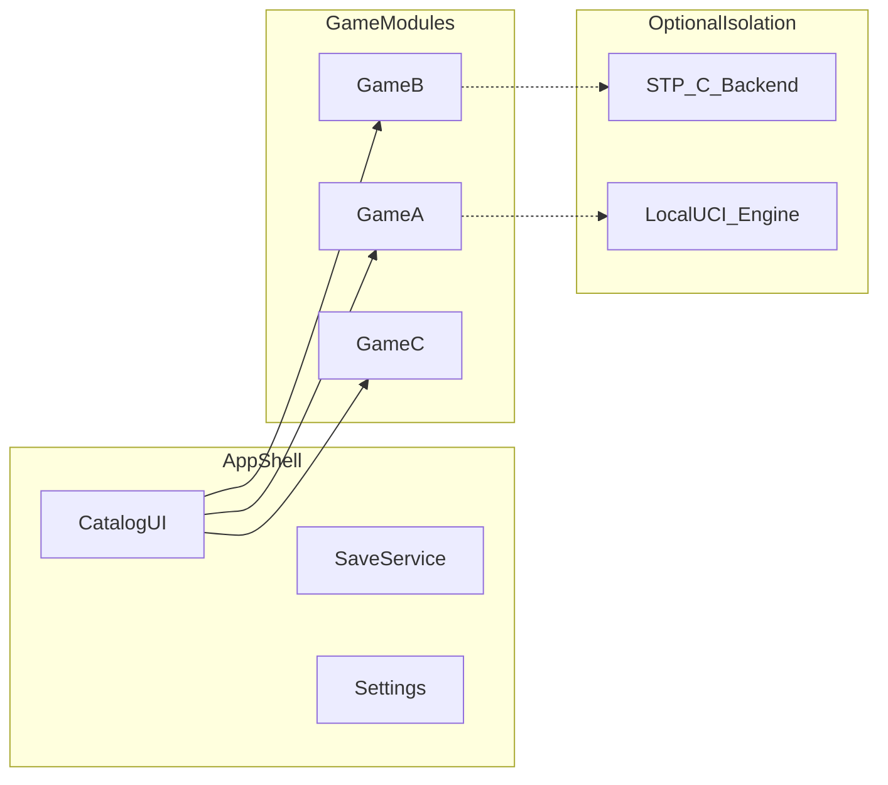

# Engineering plan: PuzzlesAndGames

Companion to [PRD.md](PRD.md). This file is the **technical execution plan** for the repo (not Cursor-internal metadata).

---

## Stack (locked)

| Layer | Choice |
|-------|--------|
| Languages | **C** and/or **C++17** (or C++20) |
| Rationale | Large reusable C puzzle ecosystem; aligns with [Simon Tatham puzzles](https://www.chiark.greenend.org.uk/~sgtatham/puzzles/) upstream (C); avoid heavy runtimes (**no Godot, Flutter, or Electron** for this repo; **Rust not** the primary app language for v1). |
| Build | **CMake** or **Meson**; static link where practical. |
| Graphics | **SDL2** (zlib) for v1; **Raylib** / **GLFW** remain optional if a future game fits better. |
| Shell UI (optional) | **Dear ImGui** (MIT) on top of SDL2/OpenGL/Vulkan if menus should ship quickly. |
| Fonts | Bundle **Inter** or **Source Sans 3** (OFL) + license text. |

### Open technical forks

- **SDL2 vs Raylib**: **SDL2** chosen for the first shipped game; Raylib remains an option if a future title benefits from it.
- **All-C** vs **C++ shell + C cores** for cleaner RAII in the launcher only.

---

## Architecture



### Module contract (conceptual)

Each game module should expose a small API, for example:

- Identity: stable `game_id`.
- Lifecycle: `init`, `shutdown`, `new_game(config)`, `restart`.
- Loop: `apply_input(event)`, `tick(dt)`, `render(renderer)`.
- State: `serialize`, `deserialize` (for saves and bug reports).
- Help: local rules text or path to bundled doc.

---

## Third-party and reuse

### Simon Tatham Portable Puzzle Collection

- **License**: MIT (confirm in upstream `LICENCE` when vendoring).
- **Source**: `git clone https://git.tartarus.org/simon/puzzles.git`
- **Preferred integration**: implement a **native frontend** against the existing **porting layer** (SDL2/Raylib drawing and input), not a WebView-first path.
- **Scope**: start with a **subset** of puzzles; expand as maintenance allows.

### Chess and similar

- **Stockfish**: GPL-3.0; typical pattern is a **separate local binary** (UCI) to keep the shell license clean, or accept GPL for a combined build.
- **Checkers**: prefer maintained MIT (or compatible) code with tests.

### Other puzzles

- **2048**, **Sudoku generators**: use repos with explicit SPDX licenses; property-test generators (unique solution, etc.).

---

## Trust and CI guardrails

- **No network**: release CMake preset defines that disable optional networking in deps; CI grep/allowlist for `socket`, `connect`, `WSAStartup`, `WinInet`, `WinHTTP`, `curl` (justify exceptions in review).
- **Quality**: ASan/UBSan builds in CI where runners support it; cppcheck or equivalent; fuzz parsers for saves and seeds.
- **Legal**: `third_party/<name>/` with pristine `LICENSE` / `COPYING` files.

---

## Distribution and updates

- **No first-party installer**: do not build or ship an MSI, Setup.exe, or similar elevated-install flow as the primary delivery path. Prefer **portable archives** (zip, tarball) and **documented extract-and-run** layouts.
- **No admin rights for normal use**: default install and run paths must work **per-user** without UAC elevation or root (system-wide installs may exist only as optional package-manager behavior the user explicitly chooses).
- **No in-app auto-update**: do not add HTTP downloaders, background updaters, or Sparkle-style self-update inside the app. **Package managers** (for example **winget**, **apt**, **dnf**, **Homebrew**) own versioning and upgrades; portable users replace the folder or use their own tooling.
- **Release artifacts**: CI should produce **unsigned portable binaries** plus metadata that downstream packagers can consume; **winget** / **Linux distro** / **brew cask** manifests live outside the app or in separate packaging repos as needed.

---

## Delivery checklist (engineering)

- [x] Lock toolchain: C11, CMake, SDL2 via FetchContent (first game ships with SDL2).
- [x] Choose SDL2 vs Raylib: **SDL2** for v1 (see root `CMakeLists.txt`).
- [ ] SPDX license matrix: shell + each game + engines (GPL boundary for chess).
- [ ] Time-box STP spike: one puzzle end-to-end on chosen graphics layer.
- [ ] Catalog shell MVP: launcher grid; today the exe boots directly into **2048**.
- [ ] Release engineering: Windows/Linux/macOS **portable** artifacts (no first-party installer); per-user install story; optional **package-manager** manifests (winget, apt, brew) maintained separately from the app; macOS signing/notarization only if a packager requires it; reproducible build notes.

---

## Repository layout (target, incremental)

Suggested as code lands:

```
PuzzlesAndGames/
  PRD.md
  PLAN.md
  README.md
  LICENSE
  CMakeLists.txt          # or meson.build
  src/                    # shell + shared
  games/                  # one directory per game module
  third_party/            # vendored upstreams + licenses
  .cursor/rules/         # Cursor project rules
```

---

## References

- [PRD.md](PRD.md)
- [Simon Tatham's Portable Puzzle Collection](https://www.chiark.greenend.org.uk/~sgtatham/puzzles/)
